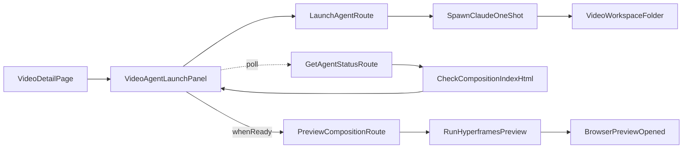

# Milestone 5 — One-shot Claude + Composition Preview

## Scope locked

- Agent execution is **CLI one-shot only** via `claude -p`.
- Output target is a **Hyperframes composition** in a deterministic per-video workspace.
- UI waits for readiness by polling; once ready, it enables a **Preview** button.
- Preview action runs `hyperframes preview` in that video's workspace and lets Hyperframes open a browser.
- **Rendering/export is excluded** from this milestone.
- Local-only, single-user assumptions remain in effect.

## Implementation plan

### 0. Product reframe (copy + vision)

- Update copy in [components/VideoListPage.tsx](components/VideoListPage.tsx) and [components/VideoDetailPage.tsx](components/VideoDetailPage.tsx) to emphasize personal creation workflow.
- Add explicit "Create composition" + "Preview composition" language (not "render video").
- Update [docs/index.md](docs/index.md) architecture summary to include launch → poll → preview loop.

### 1. Postinstall bootstrap (Hyperframes skill)

- Add `scripts/postinstall.ts` and wire `"postinstall": "tsx scripts/postinstall.ts"` in [package.json](package.json).
- Ensure `~/.claude/skills/hyperframes/` is installed from a pinned source (idempotent, no repo vendoring).
- Print setup diagnostics (skill path found/installed, claude binary check, hyperframes binary check).

### 2. Per-video workspace contract

- Introduce deterministic workspace root: `cloud-storage/video-workspaces/{videoId}/`.
- Standardize files:
  - `prompt.txt` (last prompt used)
  - `composition/index.html` (required readiness file)
  - `composition/hyperframes.json` (optional but recommended)
  - `.veed-status.json` (last known launch/status metadata)
- "Composition ready" definition for polling: `composition/index.html` exists and is non-empty.

### 3. Launch route (one-shot prompt flow)

- Add `api/LaunchAgentRoute.ts` wired by `app/api/videos/[id]/agent/route.ts` (POST).
- Validate `videoId` and load video title/description/tags.
- Build one-shot prompt in `lib/agent/prompt.ts` that instructs Claude to:
  - use Hyperframes skill,
  - create/update composition files in `composition/`,
  - keep output previewable via `hyperframes preview`.
- Execute detached CLI:
  - `spawn("claude", ["-p", prompt], { cwd: workspaceDir, detached: true, stdio: "ignore" })`
  - `unref()` to return immediately.
- Track in-memory status in `lib/agent/jobs.ts` keyed by `videoId` (plus optional `jobId` for history).
- Return `202` with `{ status: "running", videoId, jobId }`.

### 4. Polling/status route + UI state model

- Add `api/GetAgentStatusRoute.ts` wired by `app/api/videos/[id]/agent/status/route.ts` (GET).
- Compute status from both process metadata + filesystem checks:
  - `idle` (never launched)
  - `running` (job started, composition not ready yet)
  - `ready` (`composition/index.html` exists)
  - `error` (spawn/process failure, missing dependencies, or timed-out run)
- In `components/VideoAgentLaunchPanel.tsx`:
  - poll status every 2-3s after launch,
  - stop polling once status is `ready` or `error`,
  - enable Preview button only when `ready`.

### 5. Preview flow

- Add `api/PreviewCompositionRoute.ts` wired by `app/api/videos/[id]/preview/route.ts` (POST).
- Preconditions:
  - workspace exists,
  - composition ready (`index.html` present).
- Run detached command in workspace:
  - `hyperframes preview`
- Return structured result (`started: true`) or actionable error (`composition_not_ready`, `hyperframes_not_found`).
- UI `Preview` button calls this route and surfaces success/error toast.

### 6. Tests (unit + API, no e2e)

- `lib/agent/prompt.test.ts` — prompt includes title/description/tags + output contract.
- `lib/agent/workspace.test.ts` — workspace path and readiness checks.
- `api/LaunchAgentRoute.test.ts` — valid launch, missing video, missing `claude` binary.
- `api/GetAgentStatusRoute.test.ts` — transitions: idle/running/ready/error.
- `api/PreviewCompositionRoute.test.ts` — blocked when not ready, starts command when ready, dependency error handling.
- Playwright coverage for this feature remains out of scope.

### 7. Docs + ADRs + roadmap

- Add `docs/agent-workflow.md` documenting:
  - one-shot `claude -p` flow,
  - workspace contract,
  - readiness polling rule,
  - preview command behavior.
- Update [docs/roadmap.md](docs/roadmap.md) Milestone 5 wording to reflect composition-preview scope and rendering deferral.
- Add ADRs in [docs/decisions.md](docs/decisions.md):
  - **ADR-009 — One-shot `claude -p` launch model**
  - **ADR-010 — Composition readiness + preview contract**
- Add README future improvements note for:
  - rendering/export pipeline deferred,
  - e2e coverage for Claude/Hyperframes flow deferred.

## Data flow

## Acceptance criteria

- Launching from video detail runs detached `claude -p` one-shot in that video's workspace.
- Polling shows running/ready/error accurately using deterministic filesystem readiness.
- Preview button stays disabled until composition is ready, then runs `hyperframes preview` successfully.
- No rendering/export code path is introduced in this milestone.
- Docs/roadmap/ADRs clearly document this preview-first scope and deferred rendering/e2e work.

## Non-goals (explicit)

- Desktop/Cowork deep-link launch or prompt autofill.
- Callback-based ingest for generated video files.
- Video rendering/export pipeline.
- Playwright e2e automation for Claude + Hyperframes runtime integration.
