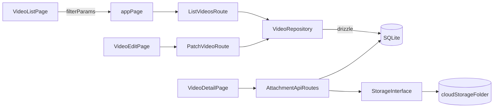

# Milestones 2-4 Plan

## Scope and decisions locked

- Migrate from the current `CREATE TABLE IF NOT EXISTS` pattern to **Drizzle ORM** for schema-as-code and versioned migrations. Drizzle wraps `better-sqlite3` directly and keeps the `VideoRepository` pattern intact.
- Pagination is **deferred** — not in scope for these milestones.
- Milestone 3 uses **simple-first UX**: dedicated detail page (read-only) and edit page (form), per-card delete action, and basic filter toolbar.
- Milestone 4 introduces a local storage abstraction (`list`/`download`/`upload`) backed by `cloud-storage`. `download` returns a `Buffer`; `upload` accepts a `Buffer`. Simple enough to swap to streams or presigned URLs in Milestone 5.

## Implementation sequence

### 0) Foundation — Drizzle ORM migration

This unblocks all subsequent schema changes cleanly.

- Install `drizzle-orm` + `drizzle-kit` alongside existing `better-sqlite3`.
- Replace [lib/db/migrate.ts](lib/db/migrate.ts) with a Drizzle schema file (e.g. `lib/db/schema.ts`) defining the `videos` table.
- Add a `drizzle.config.ts` at the project root.
- Generate and commit the initial migration (keeps `pnpm seed` working unchanged).
- Update [lib/db/get-db.ts](lib/db/get-db.ts) to run Drizzle migrations at startup instead of the manual `migrate()` call.
- Update [lib/repositories/sqlite-video-repository.ts](lib/repositories/sqlite-video-repository.ts) to use Drizzle query builder (or keep raw SQL — Drizzle supports both).

### 1) Milestone 2 — Accessibility

- **Tag chip keyboard/a11y hardening** in [components/TagChipInput.tsx](components/TagChipInput.tsx) and [components/VideoCreatePage.tsx](components/VideoCreatePage.tsx):
  - Add explicit Escape behavior.
  - Add `aria-describedby` wiring for helper/error text.
  - Propagate `aria-invalid` for tags errors.
  - Ensure remove-chip buttons have visible keyboard focus.
- **Landmarks and reduced motion** in [app/layout.tsx](app/layout.tsx) and [app/globals.css](app/globals.css):
  - Add `<main>` landmark and optional skip link.
  - Add `prefers-reduced-motion` fallbacks for animated surfaces.

### 2) Milestone 3 — Edit/delete and search/filter

- **Repository + validation extensions**:
  - Add `getById`, `update`, `delete` methods and list filter support (`title`, `tag`, `from`, `to`) in [lib/repositories/video-repository.ts](lib/repositories/video-repository.ts) and [lib/repositories/sqlite-video-repository.ts](lib/repositories/sqlite-video-repository.ts).
  - Extend `lib/db/schema.ts` with any needed indexes; generate migration.
  - Add filter schema and update body schema in [lib/validation/video.ts](lib/validation/video.ts).
- **API routes**:
  - Keep `/api/videos` for list/create in [app/api/videos/route.ts](app/api/videos/route.ts).
  - Add `app/api/videos/[id]/route.ts` for `PATCH`/`DELETE` with route handlers mirroring current style.
- **Pages and UI**:
  - Add `app/videos/[id]/page.tsx` (thin wrapper) → `components/VideoDetailPage.tsx` — read-only view of title, description, tags, dates, and attachment list (stub for now).
  - Add `app/videos/[id]/edit/page.tsx` (thin wrapper) → `components/VideoEditPage.tsx` — edit form for title, description, and tags; navigates back to detail on save.
  - Add filter toolbar to [components/VideoListPage.tsx](components/VideoListPage.tsx) (title text, single tag filter, date range via URL params).
  - Add per-card delete action with confirmation in [components/VideoListPage.tsx](components/VideoListPage.tsx).

### 3) Milestone 4 — Multi-file attachments + local storage interface

- **Storage interface layer** in new `lib/storage/` directory:
  - `lib/storage/storage.ts` — TypeScript interface with `list(prefix)`, `upload(key, buffer, metadata)`, `download(key)`.
  - `lib/storage/local-fs-storage.ts` — writes under `cloud-storage/` folder (created at runtime).
  - `lib/storage/index.ts` — `getMediaStorage()` factory (env-driven root, temp dir for tests).
  - Add `cloud-storage/` to [.gitignore](.gitignore).
- **DB schema for attachments** via Drizzle:
  - Add `video_attachments` table to `lib/db/schema.ts` (`video_id`, `storage_key`, `filename`, `content_type`, `byte_size`, `created_at`); generate migration.
  - Add attachment metadata type in [lib/types/video.ts](lib/types/video.ts).
- **App/API integration**:
  - Add `app/api/videos/[id]/attachments/route.ts` for list and upload.
  - Add `app/api/videos/[id]/attachments/[key]/route.ts` for download (streams `Buffer` to response).
  - All byte operations go through storage interface only; SQL metadata goes through repository.
  - Populate `VideoDetailPage.tsx` attachment section with list and upload UI.

## Cross-cutting test plan

- **Unit/repository**: extend [lib/repositories/sqlite-video-repository.test.ts](lib/repositories/sqlite-video-repository.test.ts) for filters, update/delete, and attachment metadata queries.
- **Storage**: new Vitest suite with a temp directory for `LocalFsStorage` (`list`/`upload`/`download`).
- **Validation**: extend [lib/validation/video.test.ts](lib/validation/video.test.ts) for new filter and update schemas.
- **Component tests**: extend [components/TagChipInput.test.tsx](components/TagChipInput.test.tsx), add tests for filter toolbar and edit form.
- **E2E**: extend [e2e/library.spec.ts](e2e/library.spec.ts) for filter, edit/delete, and attachment upload/list/download smoke; update [e2e/global-setup.ts](e2e/global-setup.ts) to clean the storage root alongside the DB.

## Recommended delivery order

1. Drizzle foundation (unblocks all schema changes).
2. Milestone 2 a11y fixes.
3. Milestone 3 repository/API methods.
4. Milestone 3 UI (detail + edit pages, filters, delete).
5. Milestone 4 storage interface and schema.
6. Milestone 4 attachment API + UI + tests.

## Notes to keep architecture clean

- Keep page components in `components/` and route files in `app/` as thin wrappers.
- Keep cloud-storage byte operations isolated to `lib/storage/*`; repository owns metadata only.
- Keep URL as source of truth for sort and filter state to preserve shareable views and testability.
- Drizzle schema in `lib/db/schema.ts` is the single source of truth for table definitions going forward.
