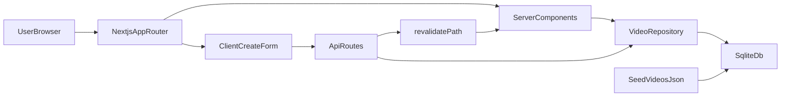

# Video Library MVP Plan

## Agreed Decisions

- **Architecture:** Next.js (App Router) full-stack, TypeScript, pnpm.
- **UI stack:** Tailwind + shadcn/ui. Page components under `@/components/...` (e.g. `@/components/VideoListPage.tsx`); files in `app/` only import/export them.
- **Data fetching:** Server Components for list page; client form for create calling a POST route; `revalidatePath('/')` + `router.refresh()` after successful create. No react-query for MVP.
- **State:** Zustand scoped narrowly to a toast/notification store. Rationale documented in `docs/decisions.md`.
- **Persistence:** SQLite via `better-sqlite3` behind a `VideoRepository` TypeScript interface. DB file stored at `./data/videos.db`, seeded once from [data/videos.json](data/videos.json) on first boot.
- **IDs:** SQLite `INTEGER PRIMARY KEY AUTOINCREMENT`. Seed inserts preserve numeric IDs 1..50 so the sequence continues at 51. User-facing format is `v-${id.toString().padStart(3, '0')}` (left-padded, minimum 3 digits, grows naturally past 999).
- **Validation:** Zod schemas in `@/lib/validation/video.ts` reused by API routes and by the client form via `@hookform/resolvers/zod`.
- **Error contract (TypeScript-enforced):**
  ```
  type ApiError = { error: { code: string; message: string; fields?: Record<string, string> } }
  ```
  All non-2xx responses conform to this shape; shared response helpers enforce it at the type level.
- **Forms:** `react-hook-form` + Zod resolver on the create page.
- **Tag input UX:** custom chip input composed from shadcn `Input` + `Badge` (Enter/comma commits, backspace removes last). Keyboard-accessibility polish is deferred to roadmap.
- **Sort UX:** shadcn `DropdownMenu` with options "Newest first" / "Oldest first", state stored in URL search params (`?sort=newest|oldest`) so the list page can read it as a Server Component prop and e2e tests can deep-link.
- **Testing:** Vitest with two configs (node env for API/repo/util tests, jsdom env for component tests) + Playwright with a `webServer` hook for e2e.
- **Lint/format:** Next.js default ESLint config + existing Prettier config.
- **Editor theme:** `.vscode/settings.json` title bar set to:
  - `titleBar.activeBackground`: `#96FF1A`
  - `titleBar.activeForeground`: `#0B1300`
  - `titleBar.inactiveBackground`: `#6FC400`
  - `titleBar.inactiveForeground`: `#0B1300`
- **README:** will NOT be edited by the agent; user maintains it manually.

## Non-goals (tracked in roadmap)

Auth, pagination, search, edit/delete, video upload/playback, full accessibility pass, and rich keyboard UX for the tag chip input are out of scope for MVP and live in [docs/roadmap.md](docs/roadmap.md).

## Default values for new videos

- `thumbnail_url`: `https://picsum.photos/seed/v-${paddedId}/300/200`
- `created_at`: `new Date().toISOString()`
- `duration`: `0`
- `views`: `0`
- `tags`: `[]` (optional input on the form)

## Implementation Plan

### 1. Scaffold foundation and theme

- Apply the four `.vscode/settings.json` title bar color values listed above.
- Initialize Next.js + TypeScript with pnpm (App Router, ESLint enabled, Tailwind enabled).
- Install: `shadcn/ui` (init), `zustand`, `zod`, `react-hook-form`, `@hookform/resolvers`, `better-sqlite3`, `@types/better-sqlite3`, `vitest`, `@vitest/ui`, `@testing-library/react`, `jsdom`, `@playwright/test`.
- Configure alias `@/*` → project root (default Next.js setup). Place page components under `@/components/`.
- Two Vitest configs:
  - `vitest.config.ts` → node env for `lib/**`, `app/api/**`, repository tests.
  - `vitest.components.config.ts` → jsdom env for component tests under `components/**`.
- Playwright config with `webServer: { command: 'pnpm build && pnpm start', ... }` (or `pnpm dev` in CI-less local mode).

### 2. Document product and roadmap

Create:

- [docs/index.md](docs/index.md) — vision, target users, high-level architecture (with mermaid), design decisions summary, links to other docs.
- [docs/roadmap.md](docs/roadmap.md) — milestone-based features including explicit non-goals list (auth, pagination, search, edit/delete, upload, playback, a11y pass, keyboard-accessible chip input).
- [docs/product.md](docs/product.md) — UX principles, primary user flows, empty/loading/error state copy guidelines.
- [docs/decisions.md](docs/decisions.md) — short ADR-style entries (SQLite vs JSON, Server Components vs react-query, Zustand scope, ID format, etc.).

Write docs right after scaffolding so decisions are captured before they drift.

### 3. Data layer (SQLite + Repository)

- Schema (single table for MVP):
  ```
  videos(
    id INTEGER PRIMARY KEY AUTOINCREMENT,
    title TEXT NOT NULL,
    thumbnail_url TEXT NOT NULL,
    created_at TEXT NOT NULL,
    duration INTEGER NOT NULL,
    views INTEGER NOT NULL,
    tags_json TEXT NOT NULL DEFAULT '[]'
  )
  ```
- Seeding strategy (idempotent):
  - On first boot, if `videos` is empty, parse [data/videos.json](data/videos.json), convert each `v-0XX` to its numeric ID, and `INSERT` with explicit IDs.
  - After seed, run `UPDATE sqlite_sequence SET seq = 50 WHERE name = 'videos'` so next auto-increment is `51`.
  - Subsequent boots detect an already-seeded DB and skip.
- `VideoRepository` interface (rough shape):

  ```
  interface VideoRepository {
    list(options: { sort: 'newest' | 'oldest' }): Promise<Video[]>
    create(input: CreateVideoInput): Promise<Video>
  }
  ```

  - Implementation: `SqliteVideoRepository` in `@/lib/repositories/sqlite-video-repository.ts`.
  - ID helpers in `@/lib/ids.ts`: `toDisplayId(n: number)` returns `v-${n.toString().padStart(3,'0')}`, `fromDisplayId(s: string)` parses back.
  - Domain type `Video` exposes `displayId` (user-facing) and `id` (numeric, internal).

### 4. API layer

- `GET /api/videos?sort=newest|oldest` → returns `{ videos: Video[] }`; invalid sort value → 400 with `ApiError`.
- `POST /api/videos` → validates body with shared Zod schema, applies defaults, calls repository, returns created `Video` on 201. On validation failure returns 400 with `ApiError` including `fields`.
- Shared helpers: `ok()`, `created()`, `badRequest()`, `serverError()` in `@/lib/api/response.ts` with types that force the `ApiError` shape.
- API routes call `revalidatePath('/')` on successful POST.

### 5. Frontend experience

- `@/components/VideoListPage.tsx` (Server Component): reads `sort` from search params, calls repository directly, renders grid of shadcn `Card`s with title, formatted `created_at`, and `Badge` tags. `Suspense` boundary with skeleton grid for loading.
- Sort dropdown: client subcomponent using shadcn `DropdownMenu`, updates URL via `router.push('/?sort=...')`.
- `@/components/VideoCreatePage.tsx` (client): `react-hook-form` + Zod resolver. Fields: `title` (required), `tags` (optional, via custom chip input). On submit → POST `/api/videos` → on 201, `router.push('/?sort=newest')` and `router.refresh()`. Inline errors from `ApiError.fields` mapped to form state.
- Custom chip input: `@/components/TagChipInput.tsx` built on shadcn `Input` + `Badge`. Enter or comma commits a tag; click-remove on each chip.
- Global error boundary (`app/error.tsx`) + empty state component for list + per-form error banner.
- Toast store (Zustand): simple `{ items, push, dismiss }` surfaced by a `<Toaster />` mounted in the root layout.

### 6. Testing

- Unit (node):
  - `toDisplayId` / `fromDisplayId` padding and parsing.
  - Default-value generator for new videos.
  - Sort helper (if any additional ordering logic lives in TS).
  - Zod schema happy/error cases.
  - `SqliteVideoRepository` against an in-memory `better-sqlite3` instance (seed + list + create).
- Unit (jsdom):
  - `TagChipInput` add/remove behavior.
  - Sort dropdown updates URL.
- E2E (Playwright):
  - Browse and sort: visit `/`, toggle sort, assert first card changes.
  - Create: visit `/new`, fill title + two tags, submit, land on list with new card visible as first item when sorted newest.

## Architecture Snapshot



## Deliverables

- Working local app with list/create flows backed by SQLite.
- `docs/` populated with `index.md`, `roadmap.md`, `product.md`, `decisions.md`.
- Updated `.vscode/settings.json` title bar palette.
- Unit + e2e test suites with two Vitest configs and Playwright.
- README left untouched (user-owned).
