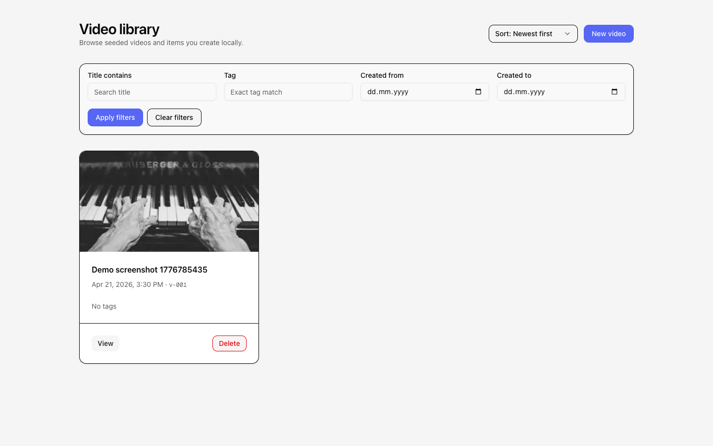
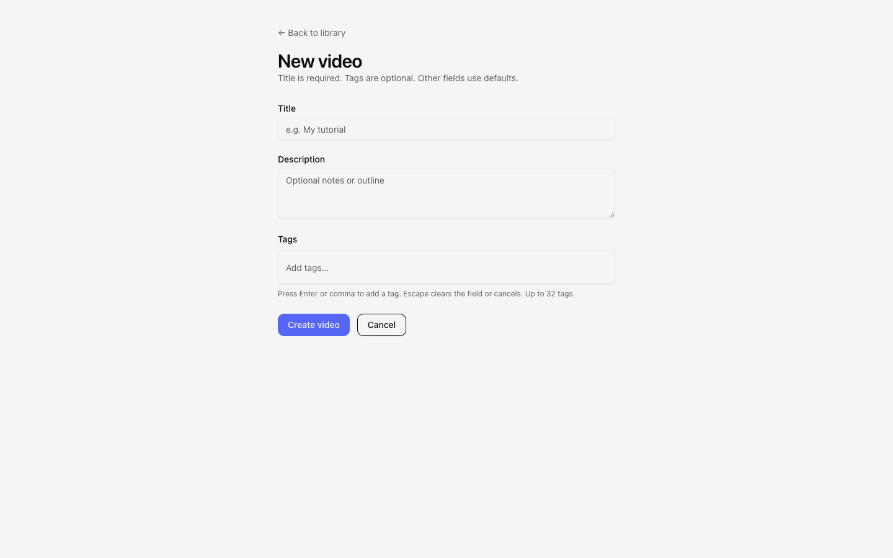
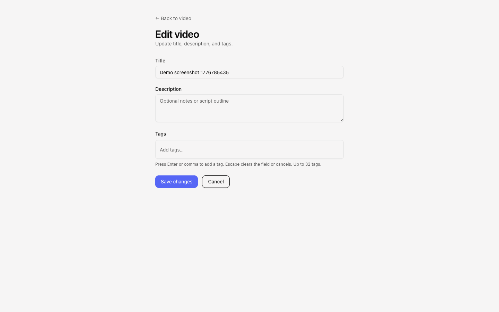
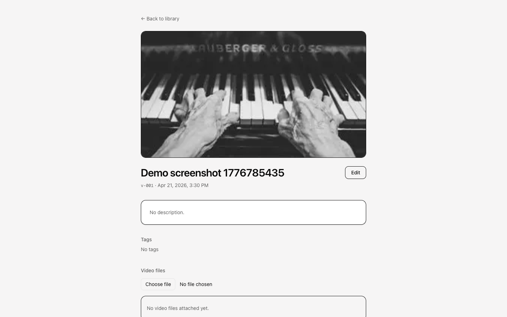

# Veed Challenge

My implementation process for the challenge. This README is written by me.
I split the project into 5 milestones, 5th of which is completely unrelated to the initial scope. I spent about 5 hours in total. The 5th hour was for the extra feature (milestone 5) I added as a tinkering experiment for myself. I eventually realised that the feature was going to be half-baked at best so I decided to cut my losses and remove the feature.

## Milestones

As seen in [Roadmap](./docs/roadmap.md),

- Milestone 1 was MVP. Most of the feature described in the project brief were implemented in this phase.
- Milestone 2 was accessibility through an overall review and keyboard support.
- Milestone 3 included edit/delete functionalities for video records along with searching and filtering features on video listing page.
- Milestone 4 was about uploading and attaching video files to individual video records.
- Milestone 5 was my personal twist to the project where I wanted to connect Claude/Cursor CLI to generate motion design videos using Hyperframes skill from HeyGen based on video title and description in video records. Handling Claude's and Cursor's output turned out to be a bit more complicated than I expected so I ultimately to decide to scrap this feature. If I had a chance to restart this task, I would spend my time on implementing video playback instead of this initiative.

## Demo

View the running version on [veed.ozantunca.com](https://veed.ozantunca.com).

Screenshots (1440×900 viewport) from production:

| Screen                                    | Preview                                                  |
| ----------------------------------------- | -------------------------------------------------------- |
| Home — video library                      |      |
| Home — filtered (`title` contains “Demo”) |  |
| New video                                 |            |
| Edit video                                |          |
| Video view                                |          |

## Tech stack

- Next.js
- TypeScript
- Node.js - through Next.js API Routes
- SQLite - easy to setup, to backup, and to port data for an MVP. I would use something else if scale was a near-term concern
- Drizzle ORM for DB schema management
- Shadcn and Tailwind for UI
- Zod for schema validation
- a folder named `cloud-storage` for storing video files along with an interface called `MediaStorage` so the folder can later be swapped for an actual cloud storage.

## Setup instructions

This project uses `pnpm` so commands below will run a production build.

```sh
pnpm i
pnpm build # important for database migration
pnpm seed # for first run only
pnpm start
```

Blob storage for uploaded video files defaults to `./cloud-storage` (gitignored). Override with **`MEDIA_STORAGE_ROOT`** (absolute or project-relative path) if needed.

## Future improvements

- We can use a more scalable database whether it be SQL or NoSQL. I used SQLite for simplicity and also because I envisioned the product to be a standalone application.
- Better text search. Possible fuzzy search using Typesense, Elastic, or simply Lunr.js. Also would trigger search requests while typing instead of an explicit "apply" button.
- I'm not totally happy with filtering UI. I think it takes up too much space, especially on mobile. I would try to make it more minimal and hide it on mobile behind a button.
- An interface to play videos
- Analytics, monitoring, and observability when it's getting prepared to be rolled out to real customers.

## AI usage

I use AI heavily day to day. In fact, my template project does no include any library but only - `.cursor` folder with rules and skills

- `docs` folder with [Starting prompt](./docs/starting-prompt.md) that defines my go-to tech and where I put the project brief
- `.vscode` config to set a custom color for the title bar Cursor because that's how I visually signal to myself which project I'm looking at
- `.prettierrc`

Everything else is set up by running starting-prompt.md during the initial AI conversation. I refrain from installing specific libraries into my template project because all libraries get updated over time and not every project needs every library. It's easier to let AI know how I prefer my projects to be set up and let it do the rest.

I started by adding `videos.json` to a `data` folder and placing a project brief into `starting-prompt.md` (see initial commit).

I exported all AI conversations under [conversations](./ai-conversations/) folder.

### Workflow

I use both Cursor and Claude for coding. Claude code is useful because it comes with more generous usage than Claude's API pricing. Claude is also useful for planning features or doing more creative work. Cursor is my actual workhorse. In my experience, it tends to be a lot faster in running tools, understanding context and executing. I usually use Codex and Composer in it.

I often start in Ask mode to learn/remember specific parts of the codebase and explore how a certain feature can be implemented. Then I switch to Plan mode to clarify an action plan, get that plan reviewed by different models, execute the plan, and review the code. Of course things don't always go according to plan. AI can create redundant code when it cannot find a library, use a different approach than intended, or create UI/UX that is simply not good.

Usually I work on multiple tabs at the same time. One of them for active coding, others for investigations (debugging, understanding codebase) and planning (new features, initiatives, bug fixes).

When there are plans, I save them in the codebase and keep them for a while even if they're fully implemented. This is useful for:

- getting plans reviewed if they're not going to be implemented immediately
- debugging if a bug arises from a recent implementation
- planning follow ups.

I remove those plans after they stop being relevant. You can view them under `.cursor/plans`.
