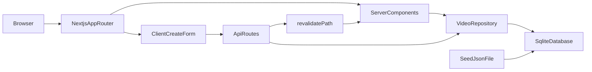

# Video library

## Vision

This project is a small, locally runnable full-stack application for browsing and managing a personal **video library**. It is optimized for fast local setup, clear architecture, and maintainable documentation so new contributors can understand goals, constraints, and technical direction without reading the codebase.

The initial scope focuses on **listing** videos with key metadata and **creating** new entries with sensible defaults. The experience should feel responsive: clear loading and error states, predictable sorting, and validation that fails with actionable messages.

## Who it is for

- Developers evaluating the implementation approach and engineering habits.
- Users who want a simple catalog of videos stored locally with minimal operational overhead.

## High-level architecture

The application uses **Next.js (App Router)** as a single TypeScript codebase. The UI is built with **React**, styled with **Tailwind CSS** and **shadcn/ui**, and uses **Zustand** only for lightweight client-only UI state (toast notifications). Server-rendered pages read from a **SQLite** database through a **`VideoRepository` abstraction**, keeping persistence swappable and testable.

HTTP APIs under `/api/videos` expose list and create operations for the client form and for programmatic use. After a successful create, the server **revalidates** the home route cache so the next navigation or refresh shows fresh data.

## Design decisions (summary)

- **SQLite + repository interface**: Local-first persistence with a narrow interface (`list`, `create`) so storage can evolve without rewriting UI layers.
- **Server Components for the grid**: The library list is rendered on the server for a simple data path and predictable performance on first paint.
- **URL-driven sort state**: Sorting uses `?sort=newest|oldest` so state is shareable and easy to test.
- **Shared validation**: Request bodies and forms share **Zod** schemas to keep client and server rules aligned.
- **Structured API errors**: Error responses follow a single JSON shape with optional field-level messages, enforced with TypeScript types on the server.

## Documentation map

- [Roadmap](./roadmap.md) — planned milestones, deferred features, and explicit non-goals.
- [Product & UX](./product.md) — user flows, UX principles, and state handling guidelines.
- [Architecture decisions](./decisions.md) — short ADR-style notes for major choices.
- [Starting prompt](./starting-prompt.md) — original brief and preferred tooling.

## Business model

Not applicable for this challenge build. Future iterations may revisit monetization or hosting assumptions; track them in [roadmap](./roadmap.md) when they become relevant.
